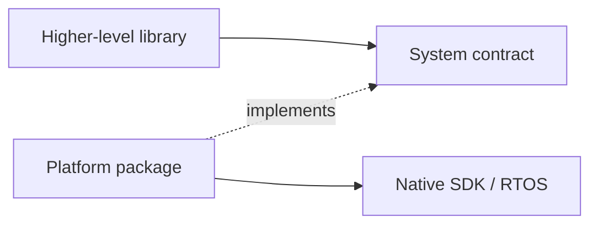

# Extension Architecture

This section is for developers extending ESPressio to another MCU, board family, RTOS, operating environment, or hardware platform.

## Boundary rule

A capability belongs in System when it is meaningful independently of a higher-level ESPressio feature domain. Concrete target implementations belong in a platform library.

Examples of System capabilities include memory, primitive execution, synchronization, queues, clocks, and GPIO.

Feature-specific concepts remain with their feature libraries. For example, WiFi lifecycle belongs to ESPressio WiFi even though an ESP32 implementation of that contract may live beside System providers in an ESP32 platform package.

## Dependency inversion

Higher-level code depends on the semantic contract, never on the native implementation.

## Extension checklist

1. Identify the semantic capability required by consuming code.
2. Reuse an existing System contract whenever it accurately represents that capability.
3. Implement the provider in the target/platform package.
4. Keep native handles, errors, and headers below the boundary.
5. Advertise optional capabilities truthfully.
6. Preserve lifetime and ownership contracts.
7. Add host/contract tests plus target-specific implementation tests.

Continue with [Implementing Providers](Implementing-Providers).