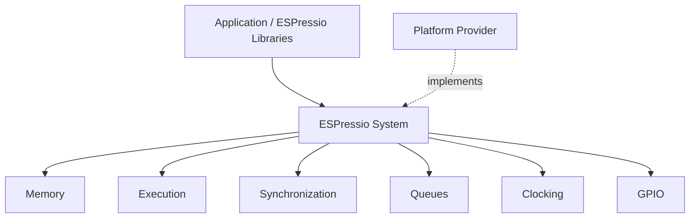

# ESPressio System

> Documentation baseline: **1.0.0**

ESPressio System defines the platform-neutral hardware and runtime vocabulary at the base of the ESPressio Development Platform. It lets higher-level libraries express requirements such as memory placement, execution, synchronization, bounded queues, clocks and GPIO without depending directly on ESP32, ESP-IDF, Arduino, FreeRTOS, or another target implementation.

This Wiki documents the **1.0.0 baseline only**. Historical ESPressio APIs and releases are intentionally outside its scope.

## Choose your documentation path

### Using ESPressio System

Application and library developers consuming the platform should begin with:

- [Getting Started](Getting-Started)
- [Memory Policies](Memory-Policies)
- [Execution](Execution)
- [Synchronization and Queues](Synchronization-and-Queues)
- [Clocks](Clocks)
- [GPIO](GPIO)
- [API Overview](API-Overview)

Most applications will consume these facilities indirectly through higher-level ESPressio libraries. Direct use is appropriate when an application needs one of the underlying capabilities itself.

### Extending ESPressio System

Developers implementing new target/platform support should begin with:

- [Extension Architecture](Extension-Architecture)
- [Implementing Providers](Implementing-Providers)
- [Memory Provider Contract](Memory-Provider-Contract)
- [Execution Provider Contract](Execution-Provider-Contract)
- [GPIO Provider Contract](GPIO-Provider-Contract)
- [Clock Provider Contract](Clock-Provider-Contract)
- [Testing Platform Providers](Testing-Platform-Providers)

The central rule is that **System owns portable capability abstractions; platform libraries own concrete implementations**. Higher-level domain abstractions remain in their respective libraries.

## Architectural position

For example, an ESP32 platform implementation can satisfy System contracts using ESP-IDF/FreeRTOS facilities while those native types remain invisible to consumers.

## Design guarantees

- Platform-neutral abstraction layer.
- No required ESP32, Arduino, FreeRTOS or ESP-IDF dependency.
- No RTTI requirement.
- Native platform handles and SDK result types do not leak into higher-level APIs.
- Explicit memory-placement policy.
- Provider-based dependency inversion.
- Higher-level domain concepts remain owned by their respective libraries.

## Related ESPressio documentation

As the coordinated 1.0.0 Wiki set is completed, this page and the top-level ESPressio Wiki will deep-link to the relevant consuming and extension documentation in dependent libraries.
